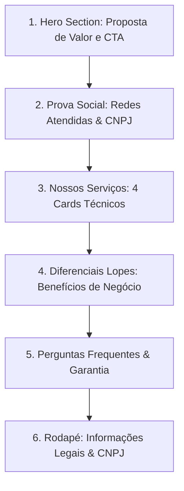

# Product Requirements Document (PRD) — Landing Page Lopes Manutenção

> **Status:** Aprovado & Pronto para Desenvolvimento
> **Versão:** 1.0.0
> **Data:** 27 de Maio de 2026
> **Autor:** Mentoria Sênior & Joelson Lopes

---

## 1. Visão Geral do Produto

### 1.1. Contexto e Problema
Supermercados, açougues, padarias e estabelecimentos de varejo alimentar dependem criticamente de seus sistemas de refrigeração e câmaras frigoríficas. Gaxetas desgastadas, molas sem tensão e portas desalinhadas causam:
1. **Vazamento Térmico:** Perda de frio e aumento drástico na conta de energia elétrica.
2. **Deterioração de Alimentos:** Riscos sanitários devido à flutuação de temperatura.
3. **Desgaste de Equipamentos:** Compressores trabalham sobrecarregados para manter o setpoint.

A **Lopes Manutenção** resolve esses problemas com agilidade e foco na eficiência térmica. No entanto, a captação de clientes atualmente depende muito do boca a boca ou de prospecção fria. Há a necessidade de uma presença digital de alta conversão para atrair tomadores de decisão locais que pesquisam no Google por soluções rápidas.

### 1.2. Objetivo do Projeto
Desenvolver uma **Landing Page (Single Page Application - SPA)** de altíssima performance, com estética profissional "Clean & Industrial", projetada especificamente para captar contatos de tomadores de decisão comerciais em Porto Alegre e Região Metropolitana, convertendo-os diretamente em conversas qualificadas no WhatsApp de **Joelson Lopes**.

### 1.3. Público-Alvo (Personas)
*   **Persona Primária (B2B):** Donos e gestores de manutenção de pequenos e médios mercados, açougues e padarias.
*   **Persona Secundária (Corporate B2B):** Compradores e gerentes de infraestrutura de grandes redes de supermercados (ex: Rede Asun). Eles buscam empresas idôneas com CNPJ ativo e emissão de Nota Fiscal (NF).

---

## 2. Escopo do Produto

### 2.1. Dentro de Escopo (Must Have)
*   **SPA de Alta Performance:** Carregamento instantâneo no 4G (Lighthouse Score > 95).
*   **Responsividade Absoluta (Mobile-First):** Foco em donos de mercados que acessam do meio da loja.
*   **Estratégia de Rastreamento (UTMs):** Leitura de parâmetros UTM via JavaScript e preenchimento de mensagem personalizada no link do WhatsApp.
*   **Estética Clean & Industrial:** Cores frias, tipografia moderna, seções claras de Prova de Autoridade e FAQs.
*   **SEO Local:** Otimização semântica para buscas de "Manutenção de câmaras frigoríficas Porto Alegre", "Troca de gaxetas de câmara fria Canoas", etc.

### 2.2. Fora de Escopo (Won't Have)
*   **Persistência em Banco de Dados (Supabase/Postgres):** Nenhum lead será salvo em banco de dados neste MVP. Foco total em YAGNI (KISS).
*   **Formulários de E-mail:** Sem integrações com serviços de envio de e-mails para evitar latência e dependências externas.
*   **Detecção de Geolocalização via IP:** Toda a página será puramente estática (SSG), sem chamadas dinâmicas de localização em tempo de execução para assegurar Lighthouse 100.

---

## 3. Arquitetura de Seções e Conteúdo

A página será estruturada em uma única página contínua (SPA) com as seguintes seções lógicas:

### Seção 1: Hero (A Primeira Impressão)
*   **Objetivo:** Capturar a atenção em menos de 3 segundos, provando resolução rápida para um problema caro.
*   **Elementos:**
    *   **H1 (Headline):** *"Mantenha o Frio, Reduza os Custos: Manutenção Especializada em Câmaras Frigoríficas em Porto Alegre e Região."*
    *   **Subtítulo:** *"Troca de gaxetas, molas e vedações com emissão de Nota Fiscal e garantia de 1 mês. Atendimento ágil para supermercados, açougues e padarias."*
    *   **CTA Principal (Botão Flutuante e Central):** *"Solicitar Orçamento via WhatsApp"* (Destaque visual em tom vibrante, com ícone de WhatsApp).

### Seção 2: Prova de Autoridade (Social Proof)
*   **Objetivo:** Mitigar a desconfiança inicial exibindo clientes corporativos de relevância.
*   **Elementos:**
    *   **Logotipos dos Clientes:** Exibição elegante (em tons de cinza metálico) dos logotipos de clientes já atendidos: *Rede Asun*, *Super Macrozatti* e *Mercado Medianeira*.
    *   **Selo de IDONEIDADE:** Destaque discreto para o CNPJ (59.909.503/0001-27) integrado ao bloco de confiança, transmitindo estabilidade para faturamento corporativo.

### Seção 3: Nossos Serviços (O que resolvemos)
*   **Objetivo:** Divisão clara do portfólio técnico em "cards" visuais de alto impacto.
*   **Os 4 Cards:**
    1.  **Vedações Térmicas:** Troca profissional de gaxetas e aplicação de fita vedante para estanqueidade máxima do frio.
    2.  **Mecânica de Portas:** Substituição de molas de torção e dobradiças reforçadas para fechamento hermético de correr ou girar.
    3.  **Revitalização de Balcões:** Instalação de fitas LED de alta eficiência, substituição de cabeceiras e desgerminação técnica.
    4.  **Troca de Gaxetas de Encaixe:** Substituição ágil de perfis de borracha imantados ou de encaixe em câmaras e balcões de congelados.

### Seção 4: Diferenciais Técnicos (O Valor de Negócio)
*   **Objetivo:** Conectar o serviço técnico com a dor financeira do cliente.
*   **Destaques:**
    *   **Economia de Energia Medida:** Menos consumo elétrico devido ao menor ciclo de funcionamento do compressor.
    *   **Conformidade Fiscal Total:** Emissão de Nota Fiscal eletrônica (NF-e) de serviços, essencial para aprovação e faturamento em redes.
    *   **Velocidade Operacional:** Soluções executadas sem a necessidade de paralisar as vendas ou desligar o mercado por longos períodos.

### Seção 5: FAQ & Prazos
*   **Objetivo:** Reduzir o atrito de decisão quebrando objeções comuns antes do clique.
*   **Perguntas Mapeadas:**
    1.  *Qual o prazo de garantia?*
        *   **Resposta:** Oferecemos garantia de 01 mês em todos os serviços executados e materiais aplicados.
    2.  *Vocês atendem fora de Porto Alegre?*
        *   **Resposta:** Sim, atendemos Canoas, Alvorada e toda a Região Metropolitana de Porto Alegre de forma ágil.
    3.  *Como funciona a forma de pagamento?*
        *   **Resposta:** Facilitamos a operação: sinal/entrada para a reserva de materiais especiais e saldo restante na conclusão do serviço. Para empresas parceiras, dispomos de faturamento sob consulta.

### Seção 6: Rodapé (Footer)
*   **Elementos:**
    *   Logo da Lopes Manutenção de forma discreta.
    *   Termos e Informações Legais.
    *   Texto corporativo: *"Lopes Manutenção — CNPJ: 59.909.503/0001-27. Porto Alegre, RS — Todos os direitos reservados."*

---

## 4. Estratégia de Rastreamento (UTMs e Mensagem de Conversão)

Para maximizar a inteligência de negócios, a landing page irá ler dinamicamente os parâmetros da URL (`?utm_source=...&utm_medium=...&utm_campaign=...&service=...`) através do Client-Side do Next.js e injetar esses dados na URL de conversão do WhatsApp.

### 4.1. Estrutura de Parâmetros
*   `utm_source`: Origem do tráfego (ex: `google`, `facebook`, `instagram`, `organico`).
*   `utm_campaign`: Campanha de anúncios (ex: `câmaras-porto-alegre`, `gaxetas-canoas`).
*   `utm_content`: Serviço específico do clique (ex: `gaxeta`, `mola`, `balcao-led`).

### 4.2. Algoritmo de Geração da Mensagem do WhatsApp
Quando o usuário clica no CTA, um link dinâmico é gerado seguindo o padrão:
`https://wa.me/55519XXXXXXXX?text=[MENSAGEM_CODIFICADA]`

#### Exemplo de Mensagem Gerada:
> *"Olá Lopes! Vi a página de Lopes Manutenção pelo **[Google]** e preciso de um orçamento para **[Troca de Gaxetas / Manutenção de Molas]** para meu estabelecimento em **[Porto Alegre / Região Metropolitana]**."*

---

## 5. Diretrizes de Design & UI/UX

### 5.1. Paleta de Cores (Estética Clean & Industrial)
Para transmitir a sensação de limpeza, confiança técnica e frio, adotaremos uma paleta minimalista:
*   **Cor Primária:** Azul Marinho Profundo (`#0B2545`) — remete a profissionalismo e estabilidade.
*   **Cor Secundária:** Azul Aço / Frio (`#134074`) — para botões secundários e contrastes.
*   **Fundo Principal:** Branco Gelo (`#EEF4F8`) — para dar amplitude e sensação de ambiente refrigerado/limpo.
*   **Destaque / Ação:** Verde Esmeralda Vibrante (`#20BF55`) ou Ciano Técnico (`#00B4D8`) — para CTAs de conversão.
*   **Aviso de Cores:** **PROIBIDO** o uso de tons de roxo, violeta ou rosa (Purple Ban) para preservar a seriedade industrial.

### 5.2. Tipografia
*   **Títulos (H1, H2, H3):** *Outfit* ou *Inter* (Google Fonts) em peso Bold/Extra Bold para reforçar a presença institucional e peso industrial.
*   **Textos de Apoio:** *Inter* em peso Regular/Medium para legibilidade ideal no celular.

### 5.3. Diretrizes de Imagens Realistas
O desenvolvimento técnico deve utilizar imagens fotográficas comerciais realistas (geradas via IA ou selecionadas em alta definição) com a seguinte paleta integrada:

| Seção | Descrição da Imagem | Vibe Visual |
|---|---|---|
| **Hero** | Câmara frigorífica comercial moderna, limpa, portas de aço escovado brilhantes e vedações herméticas em evidência. | Limpeza, eficiência e iluminação perfeita. |
| **Serviços** | Close-up técnico de uma mão com luvas profissionais ajustando uma gaxeta de encaixe nova ou alinhando uma mola de torção de aço. | Foco na precisão técnica e ferramentas profissionais. |
| **Iluminação** | Balcão de laticínios ou cortes de carnes impecavelmente organizado, com fita de LED branca brilhante destacando o frescor dos produtos. | Revitalização, organização e conformidade sanitária. |

---

## 6. Requisitos Técnicos e Performance

### 6.1. Stack de Desenvolvimento
1.  **Framework:** Next.js 15+ (App Router).
2.  **Renderização:** **Static Site Generation (SSG)** completo. Toda a landing page é pré-renderizada em build-time, garantindo arquivos estáticos puros (HTML/CSS/JS mínimos) servidos por CDN global.
3.  **Estilização:** Tailwind CSS v4 para velocidade e consistência de tokens utilitários.
4.  **Otimização de Assets:** Uso obrigatório de `next/image` e `next/font` para zerar o Cumulative Layout Shift (CLS) e garantir pré-carregamento.

### 6.2. Metas de Performance (Core Web Vitals)
*   **Lighthouse Performance Score:** > 95 em dispositivos Mobile (simulado em conexões 4G lentas).
*   **Largest Contentful Paint (LCP):** < 1.8 segundos.
*   **First Input Delay (FID) / Interaction to Next Paint (INP):** < 100ms.
*   **Cumulative Layout Shift (CLS):** `0.0` (Sem movimentos bruscos de layout ao renderizar fontes ou imagens).

### 6.3. SEO Local (Search Engine Optimization)
A estrutura semântica HTML deve ser impecável, contendo tags de cabeçalho lógicas e os metadados corretos no servidor:
*   **Title:** *Lopes Manutenção — Câmaras Frigoríficas Porto Alegre e Região*
*   **Description:** *Especialistas em troca de gaxetas, molas e vedações de câmaras frigoríficas e balcões comerciais. Emissão de Nota Fiscal e garantia de 1 mês em Porto Alegre, Canoas e Grande POA.*
*   **Schema Markup (LocalBusiness):** Incluir dados de estruturação JSON-LD contendo o CNPJ, endereço de atuação, telefone e especialidades de refrigeração para destaque no Google Mapas e buscas locais.

---

## 7. Critérios de Aceite e Validação

1.  **Mobile First:** A página deve estar perfeitamente legível e amigável em telas a partir de `360px` (ex: iPhones e modelos de entrada Android) sem rolagem horizontal.
2.  **Identidade Visual:** A logomarca da LOPES MANUTENÇÃO deve estar em evidência de forma fluida no cabeçalho e rodapé.
3.  **Redirecionamento Inteligente:** O clique em qualquer botão de WhatsApp deve abrir imediatamente o WhatsApp com a string de mensagem pré-formatada com as UTMs detectadas. Se nenhuma UTM for fornecida, utilizar a mensagem padrão polida.
4.  **Validação de Performance:** Sucesso nos testes do script automatizado de auditoria (`checklist.py` / `lighthouse_audit.py`).
